# Лабораторная 2. Префиксная сумма
Выполнила: Файзиева Юлия, M34331

Цель работы: Реализовать эффективную программу, вычисляющую префиксную сумму со значениями типа float с использованием OpenCL (версия 1.2).

Конфигурация ноутбука:

CPU: 12th Gen Intel i7-12700H 45W (20) 
Total Cores 14, Performance-cores 6, Efficient-cores 8, Total Threads 20      
IGPU: Intel® Iris® Xe Graphics (96EU)        
DGPU: NVIDIA GeForce RTX 3050 Mobile, 4 GB GDDR6
Memory: 32 GB, DDR5

Конфигурация сервера:
CPU: 6th Gen Intel i5-6400 
Total Cores 4, Total Threads 4      
IGPU: Intel® UHD Graphics 630        
DGPU: AMD Radeon 5700XT, 8 GB GDDR6
Memory: 8 GB, DDR4

Было решено использовать алгоритм, который делит входной масссив(здесь и далее `array`) на блоки, подсчитывает exclusive prefix sum(со сдвигом на 1 вправо) внутри блоков (up and down sweep), после подсчета делает сдвиг влево и в последнюю ячейку кладет сумму всего блока. В конце финализируем ответ для всех блоков добавлением предыдущих сумм.

## Upsweep
В работе участвуют LOCAL_WORK_SIZE work-item'ов, каждый из которых отвечает за обработку 2ух последовательных элементов. В начале мы записываем содержимое блока глобальной памяти в локальную, с проверкой, что мы не заходим за границу глобальной памяти, если да, то записываем в local в эту ячейку 0, чтобы не повлияло на ответ. 

Считаем суммы как на картинке, смотреть снизу вверх

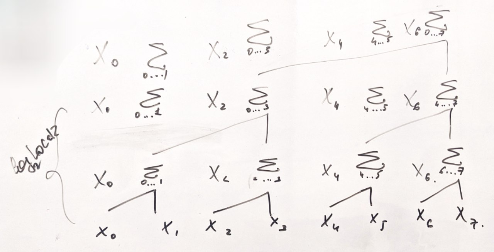

На 1ом уровне работает все work-item'ы, расстояние между слагаемыми 1.  На всех уровнях сумму записываем в правый элемент (уровни -- формальные обозначение, пока работаем в массиве в локальной памяти). Между итерациями ставим барьер. 

На уровне i подсчитываем суммы, которые покрывают $2^i$ элементов. И так пока не получим $\sum_{j = 0}^{LOCAL\_WORK\_SIZE \cdot 2 - 1}$. Таким образом нужно $\log_2(LOCAL\_WORK\_SIZE \cdot 2)$ итераций. Такой алгоритм накладывает ограничение на LOCAL_WORK_SIZE: должен быть степенью двойки.

## Downsweep

Перед самим downsweep мы сохраняем значение префиксной суммы для всего блока в вспомогательный массив в глобальной памяти (здесь и далее `sums`), который нужен будет для финальной префиксной суммы, после чего зануляем. 

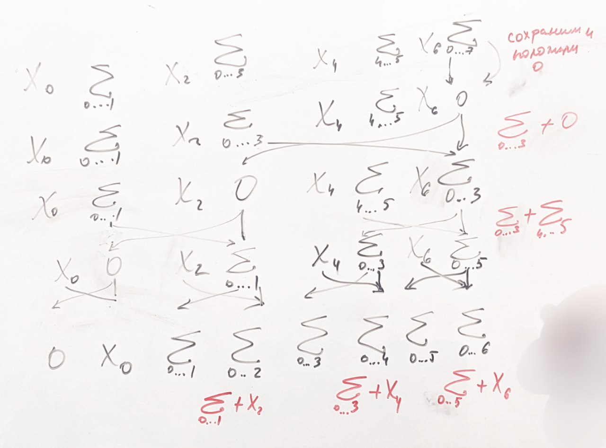

На этом этапе мы будем спускаться и, применяя посчитанные на upsweep промежуточные суммы, получим префиксные суммы для всех элементов. 

Таким образом, мы получим exclusive prefix sum, который мы преобразуем в inclusive с помощью сдвига. Тут нам пригодится тот факт, что мы сохранили последний элемент. 

В конце запишем результаты из локальной памяти в глобальную.

## Финальная сумма с шагом рекурсии
После примения up and down sweep на всех блоках мы получили префиксные суммы внутри них. Теперь мы хотим объединить все результаты: нам необходимо к значениям внутри $i$-ого блока прибавить значение суммы, посчитанной в предыдущих блоках. 

Для этого мы посчитаем в `sums`, в котором хранятся суммы значений в блоках, префиксную сумму. Для этого мы рекурсивно применяем к `sums` тот же самый алгоритм, начиная с upsweep, до тех пор, пока размер массива не будет <= размеру блока(в данном случае префиксная сумма будет получена в конце downsweep). Таким образом мы получим массив префиксных сумм в блоках. После этого мы прибавим к элементам блока $i\ \ $ $sums[i - 1]$. 

## Выводы

Были сделаны замеры скорости на разных устройствах: сначала на всех, далее на более быстрых для большей наглядности и далее были убраны самые неоптимальные параметры: чтоб показать, на каких значениях LOCAL_WORK_SIZE достигается лучшая скорость. 
Можно заметить, что скорость прямо пропорционально зависит от LOCAL_WORK_SIZE на LOCAL_WORK_SIZE <= 64 на видеокартах, на процессорах это оказывает ровно противоположный эффект.

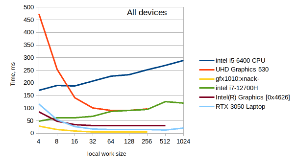

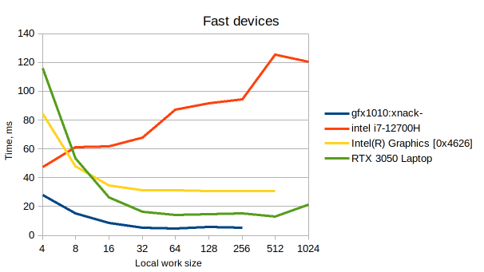

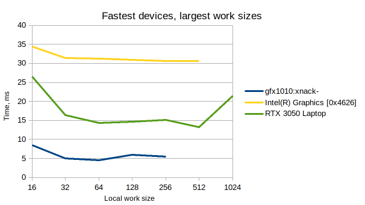

Я также решила проверить, как эффективнее реализовать такую операцию, как прибавление одного элемента. 

- сначала записали сумму из предыдущих блоков в local память (с использованием барьера), после чего все work item'ы читали этот элемент оттуда и прибавляли его к элементу в глобальной памяти 

- просто читали нужный элемент(один и тот же для всех work item'ов в одной локальной группе) из глобальной памяти, после чего прибавляли его. 

Выше были приведены графики скорости для 1го варианта, ниже для второго.

---

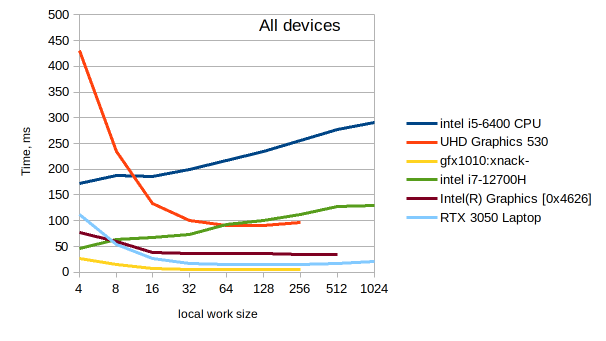

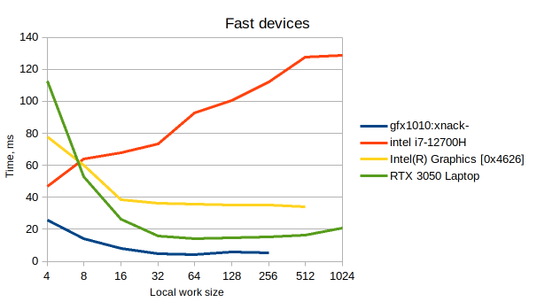

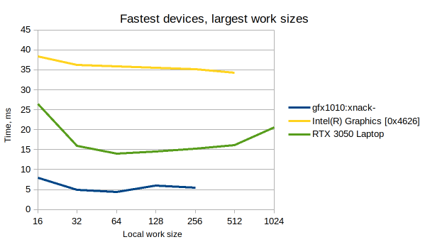

---

Посмотрим между быстрыми устройствами.

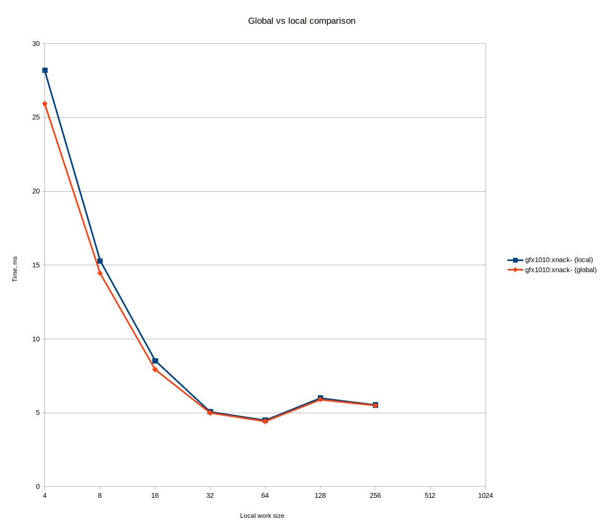

Для AMD Radeon 5700XT второй способ оказывался быстрее во всех случаях. 

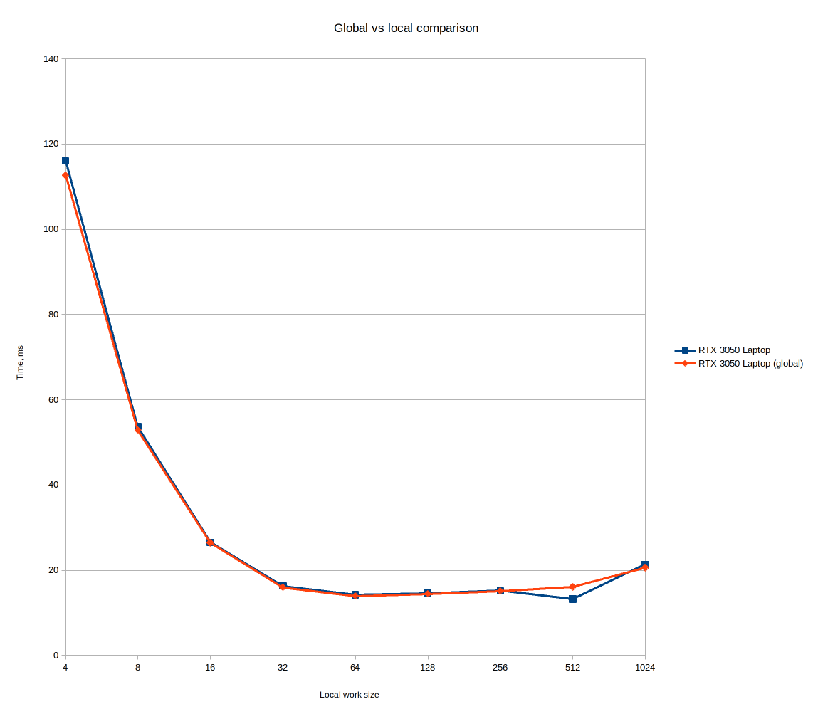

Для NVIDIA GeForce RTX 3050 Mobile также, кроме выброса на LOCAL_WORK_SIZE=512

Скорее всего, для видеокарт это ускороение можно объяснить тем, что параллельные чтения одного и того же элемента в памяти оптимизируются и выполняются одновременно.

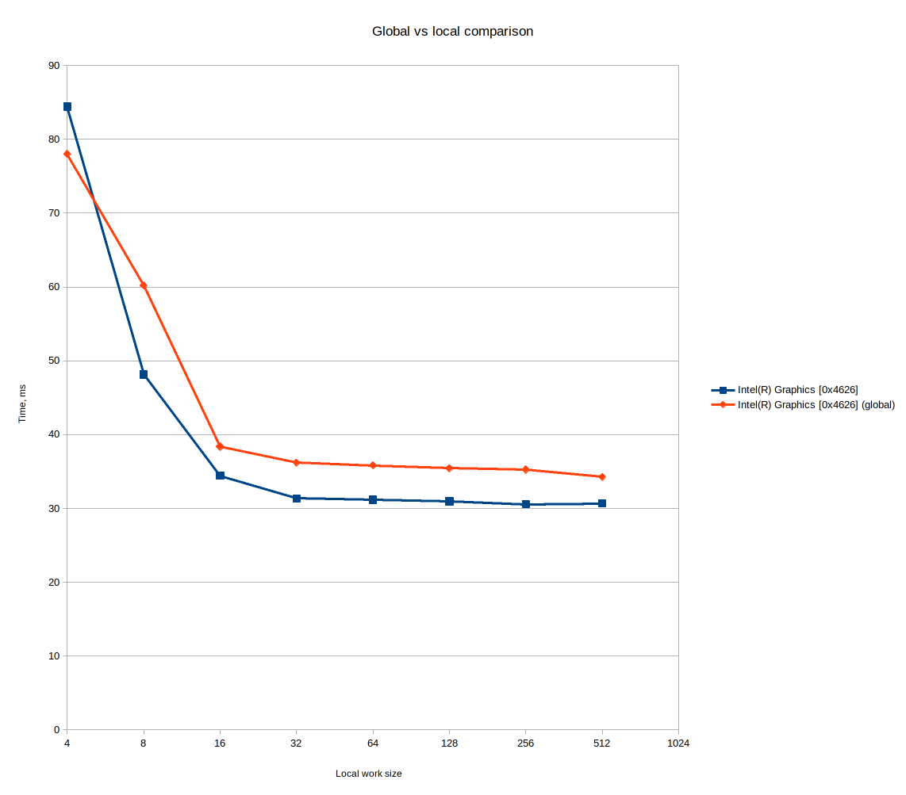

Для Intel первый вариант оказывался быстрее, кроме самого маленького размера.

## Замеры скорости
Были выполнены с помощью bash-скрипта, запускались на всех доступных устройствах, замерялось при n=67108865

## Итоговые результаты
При тестировании были получены следующие оптимальные результаты
| Номер реализации | время работы без учета передачи данных | Полное время работы | Local work size|
|------------------|----------------------------------------|---------------------|-----------|
| 0                | 4.40164                               | 68.5949             | 64         |
